# React component for Avataaars

The core React component for [Avataaars Generator](https://avataaars2.com/) updated by [Greg Schoppe](https://gschoppe.com), originally developed by [Fang-Pen Lin](https://twitter.com/fangpenlin), based on the Sketch library [Avataaars](https://avataaars.com/) designed by [Pablo Stanley](https://twitter.com/pablostanley). 

<p align="center"></p>

## Features

 - **NEW** Idle CSS animations
 - **NEW** Extendable color palettes
 - SVG based
 - Light weight 
 - Scalable
 - Easy to use
 - Easy to integrate with custom editor
 - Comes with [official editor](https://avataaars2.com/)


## How To

### Installation

First, you need to install the avataaars component package, here you run

```bash
yarn add @gschoppe/avataaars
```

or

```bash
npm install @gschoppe/avataaars --save
```

if you are using npm.

### Usage

In your React app, import the Avataaar component and put it where you like it to be, for example

```jsx
import React from 'react'
import Avatar from '@gschoppe/avataaars'

export default function MyComponent() {
  return( 
    <Avatar
      style={{width: '100px', height: '100px'}}
      backdropType='Circle'
      backdropColor='Blue01'
      topType='LongHairMiaWallace'
      accessoriesType='Prescription02'
      hairColor='BrownDark'
      facialHairType='Blank'
      clotheType='Hoodie'
      clotheColor='PastelBlue'
      eyeType='Happy'
      eyebrowType='Default'
      mouthType='Smile'
      skinColor='Light'
    />
  );
}
```

### Dynamic Random Avatars

To generate dynamic, visually balanced random avatars, you can use the built-in `generateRandomAvataarProps()` function which automatically applies probabilistic stylistic cohesion rules and prevents backdrop/hair/clothing color conflicts:

```jsx
import React from 'react'
import Avatar, { generateRandomAvataarProps } from '@gschoppe/avataaars'

export default function MyComponent() {
  // Generates complete, cohesive random options
  const randomProps = generateRandomAvataarProps()

  return (
    <Avatar
      style={{ width: '100px', height: '100px' }}
      {...randomProps}
    />
  )
}
```


### Showcase pieces

To showcase individual pieces of the avatar you can use the Piece component, for example:

```jsx
import React from 'react'
import {Piece} from 'avataaars';

export default function MyComponent() {
  return(
    <>
      <Piece pieceType="mouth" pieceSize="100" mouthType="Eating"/>
      <Piece pieceType="eyes" pieceSize="100" eyeType="Dizzy"/>
      <Piece pieceType="eyebrows" pieceSize="100" eyebrowType="RaisedExcited"/>
      <Piece pieceType="accessories" pieceSize="100" accessoriesType="Round"/>
      <Piece pieceType="top" pieceSize="100" topType="LongHairFro" hairColor="Red"/>
      <Piece pieceType="facialHair" pieceSize="100" facialHairType="BeardMajestic"/>
      <Piece pieceType="clothe" pieceSize="100" clotheType="Hoodie" clotheColor="Red"/>
      <Piece pieceType="graphics" pieceSize="100" graphicType="Skull" />
      <Piece pieceType="skin" pieceSize="100" skinColor="Brown" />
    </>
  );
}
```

### Registering Custom Colors, Alpha, and Gradients

You can register custom colors, translucent colors (alpha), and linear or radial gradients into any category palette using the `addPaletteColor()` function. 

> [!NOTE]
> - Custom color/paint names must be a single word, beginning with a capital letter (e.g. `CustomBlue`, `SunsetGradient`).
> - Registering a color/gradient with an existing name will overwrite the entry.

#### 1. Custom Hex or Color String
```javascript
import { addPaletteColor, PALETTES } from '@gschoppe/avataaars'

// Add solid color
addPaletteColor(PALETTES.HAIR, 'Magenta', '#FF00FF')
```

#### 2. Translucent Colors (Alpha)
```javascript
// Add translucent color with opacity
addPaletteColor(PALETTES.BACKDROP, 'TranslucentBlue', 'rgba(59, 130, 246, 0.5)')
```

#### 3. Linear Gradients
```javascript
addPaletteColor(PALETTES.CLOTHES, 'Sunset', {
  type: 'linear',
  attrs: { x1: '0%', y1: '0%', x2: '100%', y2: '100%' },
  stops: [
    { offset: '0%', color: '#FF5733', opacity: 1 },
    { offset: '100%', color: '#FFC0CB', opacity: 0.5 }
  ]
})
```

#### 4. Radial Gradients
```javascript
addPaletteColor(PALETTES.BACKDROP, 'BlueGlow', {
  type: 'radial',
  attrs: { cx: '50%', cy: '50%', r: '50%' },
  stops: [
    { offset: '0%', color: '#06B6D4', opacity: 1 },
    { offset: '100%', color: '#3B82F6', opacity: 1 }
  ]
})
```

### BETA - Add CSS Idle Animations

<p align="center"></p>

This is very much a work in progress. So far, Idle animations have only been added
to a few of the various avatar components. To enable these animations, just
import `@gschoppe/avataaars/dist/animations.css` in your component, like so:

```jsx
import React from 'react'
import Avatar from '@gschoppe/avataaars'
import '@gschoppe/avataaars/dist/animations.css'

export default function MyComponent() {
  return( 
    <Avatar
      style={{width: '100px', height: '100px'}}
      backdropType='Circle'
      backdropColor='Blue01'
      topType='LongHairMiaWallace'
      accessoriesType='Blank'
      hairColor='BrownDark'
      facialHairType='Blank'
      clotheType='Hoodie'
      clotheColor='PastelBlue'
      eyeType='EyeRoll'
      eyebrowType='Default'
      mouthType='Serious'
      skinColor='Light'
    />
  );
}
```


### Animating Raw or Embedded SVGs

If you are rendering raw SVGs directly (e.g. from a backend/REST service or custom compiler), you can still enable these beautiful animations:

1. Ensure the root container group of your avatar SVG uses an ID ending in `-Avataaar` (this is the default behavior when rendering with the `animated` option set to `true`).
2. Load the `@gschoppe/avataaars/dist/animations.css` stylesheet in your HTML document to apply the keyframes to your SVGs:

```html
<!-- Load the stylesheet in your HTML head -->
<link rel="stylesheet" href="node_modules/@gschoppe/avataaars/dist/animations.css">
```


### Positional Configuration Hashing

You can serialize any complete avatar configuration into a compact, URL-safe 15-character Base-62 shorthand hash (and decode it back synchronously) using the core library hashing functions:

```jsx
import React from 'react'
import Avatar, { getAvatarHash, getAvatarConfigFromHash } from '@gschoppe/avataaars'

export default function MyComponent() {
  // 1. Generate a stable 15-character shorthand hash
  const hash = getAvatarHash({
    backdropType: 'Diamond',
    backdropColor: 'PastelBlue',
    topType: 'ShortHairShortFlat',
    skinColor: 'Tanned'
  })
  console.log(hash) // E.g., '17z0104193aa523'

  // 2. Decode the shorthand string back into an options config object
  const config = getAvatarConfigFromHash('17z0104193aa523')

  return (
    <Avatar
      style={{ width: '100px', height: '100px' }}
      {...config}
    />
  )
}
```

*Note: Dynamically runtime-registered custom colors or gradients will receive higher indices. If they exist in a future run, they will map correctly; otherwise, they will gracefully fallback to their category defaults.*


## Available Parameters and Options

Here are all the available component properties, option values, and representative SVG icons for each choice.

### 1. Backdrop Configuration (`backdropType` & `backdropColor`)

#### Backdrop Type (`backdropType`)
| Value | Icon | Value | Icon | Value | Icon |
|---|---|---|---|---|---|
| `Circle` |  | `Diamond` |  | `NoBackdrop` |  |

#### Backdrop / Hat / Clothing Colors (`backdropColor`, `hatColor`, `clotheColor`)
| Value | Icon | Value | Icon | Value | Icon |
|---|---|---|---|---|---|
| `Black` |  | `Blue01` |  | `Blue02` |  |
| `Blue03` |  | `Gray01` |  | `Gray02` |  |
| `Heather` |  | `PastelBlue` |  | `PastelGreen` | 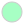 |
| `PastelOrange` |  | `PastelRed` |  | `PastelYellow` |  |
| `Pink` |  | `Red` |  | `White` |  |

---

### 2. Hair & Headwear (`topType` & `hairColor`)

#### Top styles (`topType`)
| Value | Icon | Value | Icon |
|---|---|---|---|
| `NoHair` |  | `Eyepatch` |  |
| `Hat` |  | `Hijab` |  |
| `Turban` |  | `WinterHat1` | 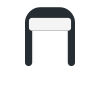 |
| `WinterHat2` | 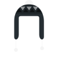 | `WinterHat3` |  |
| `WinterHat4` |  | `LongHairBigHair` |  |
| `LongHairBob` |  | `LongHairBun` |  |
| `LongHairCurly` |  | `LongHairCurvy` |  |
| `LongHairDreads` | 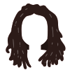 | `LongHairFrida` | 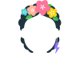 |
| `LongHairFro` |  | `LongHairFroBand` |  |
| `LongHairMiaWallace` |  | `LongHairNotTooLong` |  |
| `LongHairShavedSides` |  | `LongHairStraight` |  |
| `LongHairStraight2` |  | `LongHairStraightStrand` |  |
| `ShortHairDreads01` |  | `ShortHairDreads02` |  |
| `ShortHairFrizzle` |  | `ShortHairShaggy` |  |
| `ShortHairShaggyMullet` |  | `ShortHairShortCurly` |  |
| `ShortHairShortFlat` |  | `ShortHairShortRound` |  |
| `ShortHairShortWaved` |  | `ShortHairSides` | 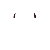 |
| `ShortHairTheCaesar` |  | `ShortHairTheCaesarSidePart` |  |

#### Hair Colors (`hairColor` & `facialHairColor`)
| Value | Icon | Value | Icon | Value | Icon |
|---|---|---|---|---|---|
| `Auburn` |  | `Black` |  | `Blonde` |  |
| `BlondeGolden` |  | `Brown` |  | `BrownDark` |  |
| `PastelPink` |  | `Blue` |  | `Platinum` |  |
| `Red` |  | `SilverGray` |  | | |

---

### 3. Facial Hair (`facialHairType`)
| Value | Icon | Value | Icon | Value | Icon |
|---|---|---|---|---|---|
| `Blank` | *(None)* | `BeardLight` |  | `BeardMajestic` |  |
| `BeardMedium` |  | `MoustacheFancy` |  | `MoustacheMagnum` |  |

---

### 4. Clothing & Fabric Graphic (`clotheType` & `graphicType`)

#### Clothes (`clotheType`)
| Value | Icon | Value | Icon | Value | Icon |
|---|---|---|---|---|---|
| `BlazerShirt` |  | `BlazerSweater` |  | `CollarSweater` | 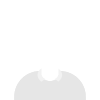 |
| `GraphicShirt` |  | `Hoodie` | 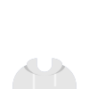 | `Overall` | 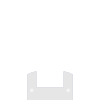 |
| `ShirtCrewNeck` |  | `ShirtScoopNeck` |  | `ShirtVNeck` |  |

#### Graphic Print (`graphicType` - used with `GraphicShirt` Clothing)
| Value | Icon | Value | Icon | Value | Icon |
|---|---|---|---|---|---|
| `Bat` | 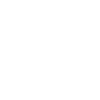 | `Cumbia` |  | `Deer` | 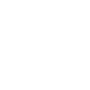 |
| `Diamond` |  | `Hola` |  | `Pizza` |  |
| `Resist` |  | `Selena` |  | `Skull` |  |
| `SkullOutline` |  | | | | |

---

### 5. Eyewear / Accessories (`accessoriesType`)
| Value | Icon | Value | Icon | Value | Icon |
|---|---|---|---|---|---|
| `Blank` | *(None)* | `Kurt` |  | `Prescription01` | 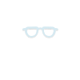 |
| `Prescription02` |  | `Round` |  | `Sunglasses` | 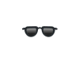 |
| `Wayfarers` | 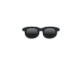 | | | | |

---

### 6. Expressions & Face Features (`eyeType`, `eyebrowType`, `mouthType`)

#### Eyes (`eyeType`)
| Value | Icon | Value | Icon | Value | Icon |
|---|---|---|---|---|---|
| `Close` |  | `Cry` |  | `Default` |  |
| `Dizzy` |  | `EyeRoll` | 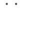 | `Happy` |  |
| `Hearts` |  | `Side` |  | `Squint` |  |
| `Surprised` |  | `Wink` |  | `WinkWacky` |  |

#### Eyebrows (`eyebrowType`)
| Value | Icon | Value | Icon |
|---|---|---|---|
| `Angry` |  | `AngryNatural` |  |
| `Default` |  | `DefaultNatural` |  |
| `FlatNatural` |  | `FrownNatural` |  |
| `RaisedExcited` |  | `RaisedExcitedNatural` |  |
| `SadConcerned` |  | `SadConcernedNatural` |  |
| `UnibrowNatural` |  | `UpDown` |  |
| `UpDownNatural` |  | | |

#### Mouth (`mouthType`)
| Value | Icon | Value | Icon | Value | Icon |
|---|---|---|---|---|---|
| `Concerned` |  | `Default` |  | `Disbelief` |  |
| `Eating` |  | `Grimace` |  | `Sad` |  |
| `ScreamOpen` |  | `Serious` |  | `SideChew` |  |
| `SideSmile` |  | `Smile` |  | `Tongue` |  |
| `Twinkle` |  | `Vomit` |  | `Whistling` |  |

---

### 7. Skin Tone (`skinColor`)
| Value | Icon | Value | Icon | Value | Icon |
|---|---|---|---|---|---|
| `Pale` | 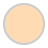 | `Light` | 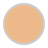 | `Yellow` |  |
| `Tanned` |  | `Brown` | 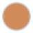 | `DarkBrown` |  |
| `Black` | 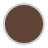 | | | | |

---

## Editor & Customization Context

To build your own custom avatar editor (like the sandbox page in the demo folder), use the lower level `Avatar` component wrapped in the `OptionContext`.

For fully working references on dynamic forms, randomizers, and color/gradient palette managers, check out the source code in `demo/src/App.tsx`.

